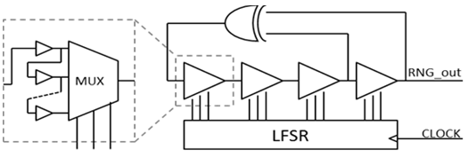

<!---

This file is used to generate your project datasheet. Please fill in the information below and delete any unused
sections.

You can also include images in this folder and reference them in the markdown. Each image must be less than
512 kb in size, and the combined size of all images must be less than 1 MB.
-->

## How it works

This project implements a LFSR where the D-type FFs (DFFs) are replaceded by configurable delay lines.

The configurable delay lines are implement using multiplexers and buffers. The buffers generate a delay line path and the multiplexer select differents paths according to its selection control signals. The selection control signals are generated by a conventional LFSR.

It's expected that this circuit act as either as a convencional LFSR, or as an oscillator, or as a chaotic oscilator, according to the path generated by each delay line.

## How to use

Explain how to use your project

## External hardware

List external hardware used in your project (e.g. PMOD, LED display, etc), if any
